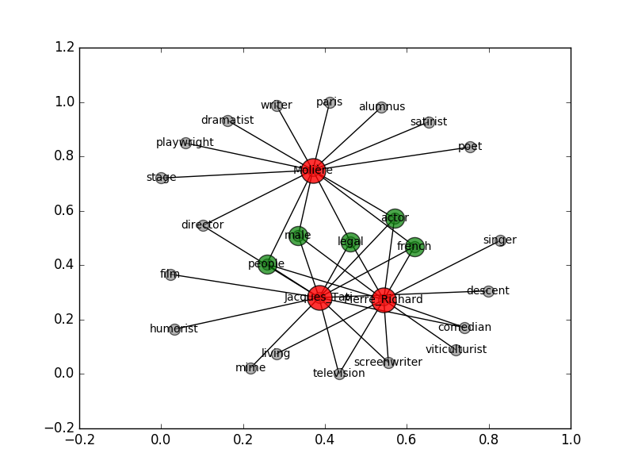

# Kraken

Projet exploratoire


* Pitch [](https://gitpitch.com/c24b/kraken_data/master?grs=github&t=moon)

* [Projet d'article](./article.md)

## Axes de développement

Projet exploratoire: Explorer un triple-store par analogie sans connaissance préalable du vocabulaire:
1. A partir des prédicats de *n* ressources
4. Détecter les similarités de description
5. et permettre l'inférence et l'alignement


## Hypothèses de travail

Décrire les liens qu'entretiennent deux ou + de ressources
à plusieurs niveaux et en déduire leurs caractéristiques majeures a partir de la similarité syntaxique des prédicats qui lui sont attachées et des.


### Comment définir une ressource a priori?
Les ressources sont reparties dans différents *triple stores* elles possèdent différentes caractéristiques parfois redondantes parfois semblables dans leur forme syntaxique.

    Exemple: dans Wikidata les ressources rentrent dans
    des 'catégories' qui ont des formes syntaxiques
    semblables avec variations/spécification

    20th-centuryActors
    21th-centuryActors
    20th-centuryFrenchMaleActors

    et qui sont aussi décrite de manière similaire dans d'autres vocabulaires
    dans l'ontologie 'umbel' par example
    Actor
    dans le triple store data.bnf.fr
    Actor http://data.bnf.fr/vocabulary/roles/r1010/
    dans idref
    Actor http://www.idref.fr/059613947#005
    dans la library of Congres
    Act http://id.loc.gov/vocabulary/relators/act.html


Sans connaissance préalable de l'ontologie, nous nous appuyons sur le vocabulaire et sa redondance morpho-syntaxique pour permettre à la machine de détecter comment est caractérisée une ressource en utilisant
les prédicats et en les découpant en unité minimale d'information *tag*
et leur attribuant un score de fréquence.

* **Typologie d'une ressource**

`ressources_types.py`
Récupérer les **prédicats** pour une ressource
dans leur forme simplifiée avec les données source,
(namespace, urls, resources)
Autrement dit, décrire la ressource et compter les différentes étiquettes
```
"Producer": {
    "_score": 2,
    "ns": [
        "http://dbpedia.org/class/yago",
        "http://dbpedia.org/class/yago"
    ],
    "resources": [
        "Jacques_Tati",
        "Jean_Dujardin"
    ],
    "urls": [
        "http://dbpedia.org/class/yago/Producer110480018",
        "http://dbpedia.org/class/yago/Producer110480018"
    ]
},
```
Transformer ces prédicats en tags par stemming et chunking
```
"Actor": {"predicates":["Actor", "20th-centuryActors","21th-centuryActors"
"20th-centuryFrenchMaleActors"], "ns"}
```


* Niveau 0: similarité entre ressources a partir des tags


```
"Producer": {
    "_score": 2,
    "ns": [
        "http://dbpedia.org/class/yago",
        "http://dbpedia.org/class/yago"
    ],
    "resources": [
        "Jacques_Tati",
        "Jean_Dujardin"
    ],
    "urls": [
        "http://dbpedia.org/class/yago/Producer110480018",
        "http://dbpedia.org/class/yago/Producer110480018"
    ]
},
```


* Comment définir la similarité entre deux ressources?

* Comment découvrir

La similarité entre n ressources est définie par
le nombre de prédicats commun pondérées par le nombre de prédicats qui la définissent.


Cette mesure de similarité est ensuite affinée par le nombre d'étapes (de pas) dans le parcours du graphe
qui s'arrête au moment ou deux objets sont communs ou lorsque la source est identique à l'objet.
---
* Premiers développements
* Outils de visualisations

---

## Premiers dévelopements

Objectif: Cartographier les points communs entre n ressources et parcourir les liens(étiquettes) qu'ils ont en commun

### Décrire une ressource a partir de ces prédicats

En prenant une ressource disponible dans un triplestore
(pour le moment wikidata)
on constitue une typologie (un dictionnaire de types) pour cette ressource à partir des prédicats qui décrivent la ressource comme composé dans le fichier [`types.json`](./types.json).
```json
{
    "20th-centuryActors": {
        "_score": 1,
        "ns": [
            "http://dbpedia.org/class/yago"
        ],
        "resources": [
            "Jean_Dujardin"
        ],
        "urls": [
            "http://dbpedia.org/class/yago/Wikicat20th-centuryActors"
        ]
    },
    "20th-centuryFrenchMaleActors": {
        "_score": 1,
        "ns": [
            "http://dbpedia.org/class/yago"
        ],
        "resources": [
            "Jean_Dujardin"
        ],
        "urls": [
            "http://dbpedia.org/class/yago/Wikicat20th-centuryFrenchMaleActors"
        ]
    },
    "21st-centuryActors": {
        "_score": 1,
        "ns": [
            "http://dbpedia.org/class/yago"
        ],
        "resources": [
            "Jean_Dujardin"
        ],
        "urls": [
            "http://dbpedia.org/class/yago/Wikicat21st-centuryActors"
        ]
    }
  }
```


* Niveau 0:
Les ressources partagent x prédicats


* Niveau 1:
Les ressources partagent des **étiquettes** de prédicats en commun

* Niveau 2 etc...
